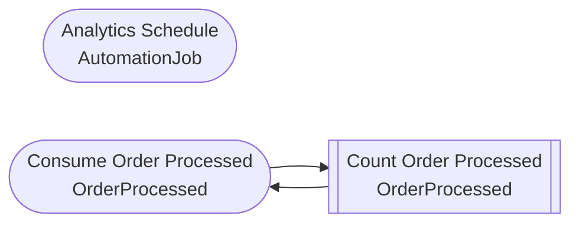

# Pipeline: analytics

```mermaid
flowchart LR
  s1(["Analytics Schedule
AutomationJob"])
  s2(["Consume Order Processed
OrderProcessed"])
  s3[["Count Order Processed
OrderProcessed"]]
  s3 --> s2
  s2 --> s3
```
