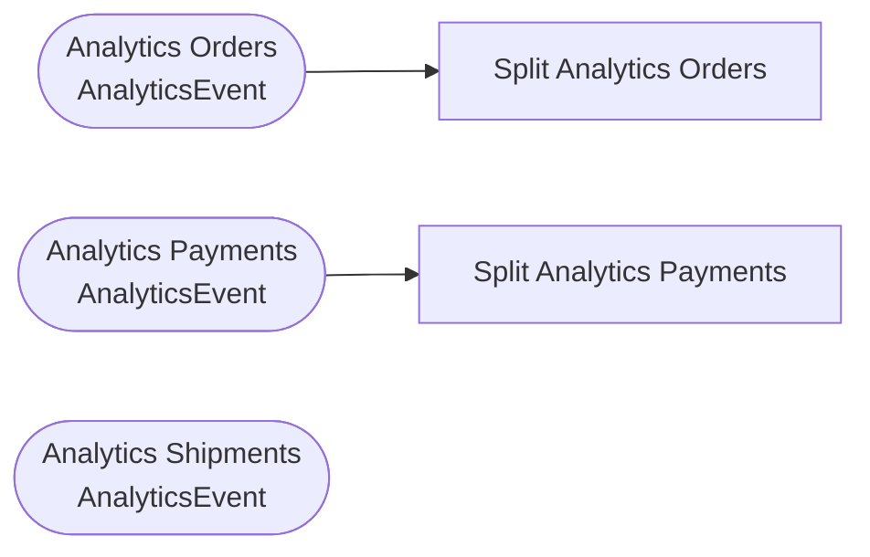

# Pipeline: analyticsSources

```mermaid
flowchart LR
  s4(["Analytics Orders
AnalyticsEvent"])
  s5(["Analytics Payments
AnalyticsEvent"])
  s6(["Analytics Shipments
AnalyticsEvent"])
  s7["Split Analytics Orders"]
  s8["Split Analytics Payments"]
  s4 --> s7
  s5 --> s8
```
