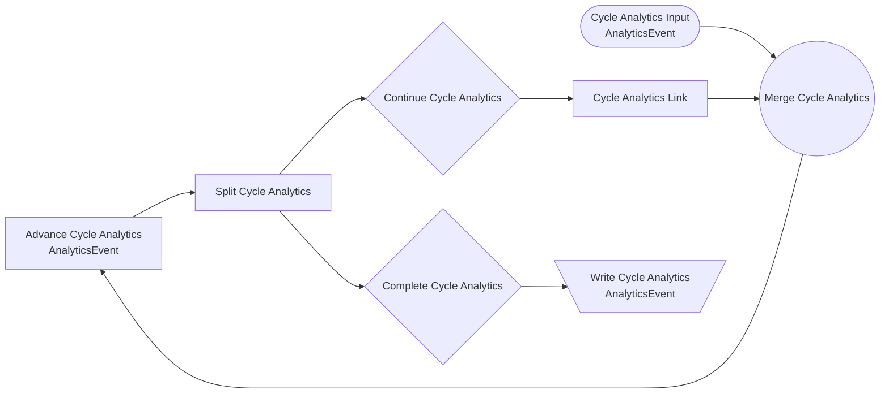

# Pipeline: cycleAnalytics

```mermaid
flowchart LR
  s9["Advance Cycle Analytics
AnalyticsEvent"]
  s10{"Complete Cycle Analytics"}
  s11{"Continue Cycle Analytics"}
  s12(["Cycle Analytics Input
AnalyticsEvent"])
  s13["Cycle Analytics Link"]
  s14(("Merge Cycle Analytics"))
  s15["Split Cycle Analytics"]
  s16[\"Write Cycle Analytics
AnalyticsEvent"/]
  s14 --> s9
  s15 --> s10
  s15 --> s11
  s11 --> s13
  s12 --> s14
  s13 --> s14
  s9 --> s15
  s10 --> s16
```
