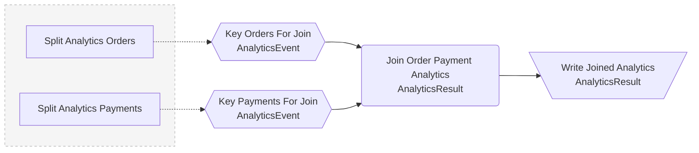

# Pipeline: joinAnalytics

```mermaid
flowchart LR
  subgraph ext[" "]
    style ext fill:#f5f5f5,stroke:#bbb,stroke-dasharray:4
    s7["Split Analytics Orders"]
    s8["Split Analytics Payments"]
  end
  s9("Join Order Payment Analytics
AnalyticsResult")
  s10{{"Key Orders For Join
AnalyticsEvent"}}
  s11{{"Key Payments For Join
AnalyticsEvent"}}
  s12[\"Write Joined Analytics
AnalyticsResult"/]
  s10 --> s9
  s11 --> s9
  s7 -.-> s10
  s8 -.-> s11
  s9 --> s12
```
