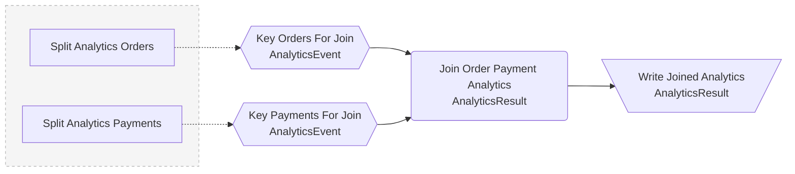

# Pipeline: joinAnalytics

```mermaid
flowchart LR
  subgraph ext[" "]
    style ext fill:#f5f5f5,stroke:#bbb,stroke-dasharray:4
    s7["Split Analytics Orders"]
    s8["Split Analytics Payments"]
  end
  s17("Join Order Payment Analytics
AnalyticsResult")
  s18{{"Key Orders For Join
AnalyticsEvent"}}
  s19{{"Key Payments For Join
AnalyticsEvent"}}
  s20[\"Write Joined Analytics
AnalyticsResult"/]
  s18 --> s17
  s19 --> s17
  s7 -.-> s18
  s8 -.-> s19
  s17 --> s20
```
