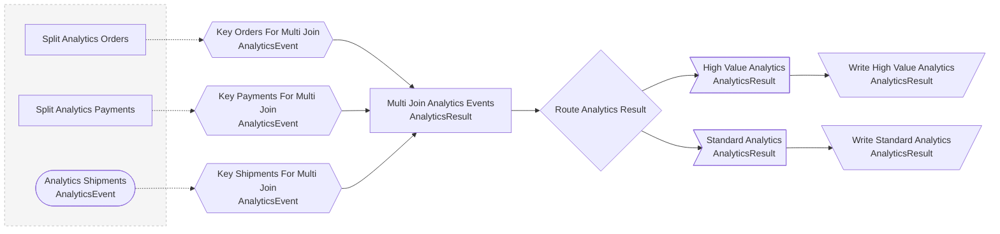

# Pipeline: multiJoinAnalytics

```mermaid
flowchart LR
  subgraph ext[" "]
    style ext fill:#f5f5f5,stroke:#bbb,stroke-dasharray:4
    s6(["Analytics Shipments
AnalyticsEvent"])
    s7["Split Analytics Orders"]
    s8["Split Analytics Payments"]
  end
  s21>"High Value Analytics
AnalyticsResult"]
  s22{{"Key Orders For Multi Join
AnalyticsEvent"}}
  s23{{"Key Payments For Multi Join
AnalyticsEvent"}}
  s24{{"Key Shipments For Multi Join
AnalyticsEvent"}}
  s25["Multi Join Analytics Events
AnalyticsResult"]
  s26{"Route Analytics Result"}
  s27>"Standard Analytics
AnalyticsResult"]
  s28[\"Write High Value Analytics
AnalyticsResult"/]
  s29[\"Write Standard Analytics
AnalyticsResult"/]
  s26 --> s21
  s7 -.-> s22
  s8 -.-> s23
  s6 -.-> s24
  s22 --> s25
  s23 --> s25
  s24 --> s25
  s25 --> s26
  s26 --> s27
  s21 --> s28
  s27 --> s29
```
