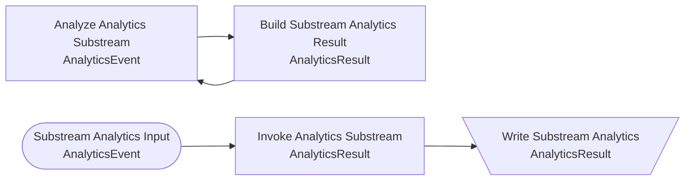

# Pipeline: substreamAnalytics

```mermaid
flowchart LR
  s30["Analyze Analytics Substream
AnalyticsEvent"]
  s31["Build Substream Analytics Result
AnalyticsResult"]
  s32["Invoke Analytics Substream
AnalyticsResult"]
  s33(["Substream Analytics Input
AnalyticsEvent"])
  s34[\"Write Substream Analytics
AnalyticsResult"/]
  s31 --> s30
  s30 --> s31
  s33 --> s32
  s32 --> s34
```
