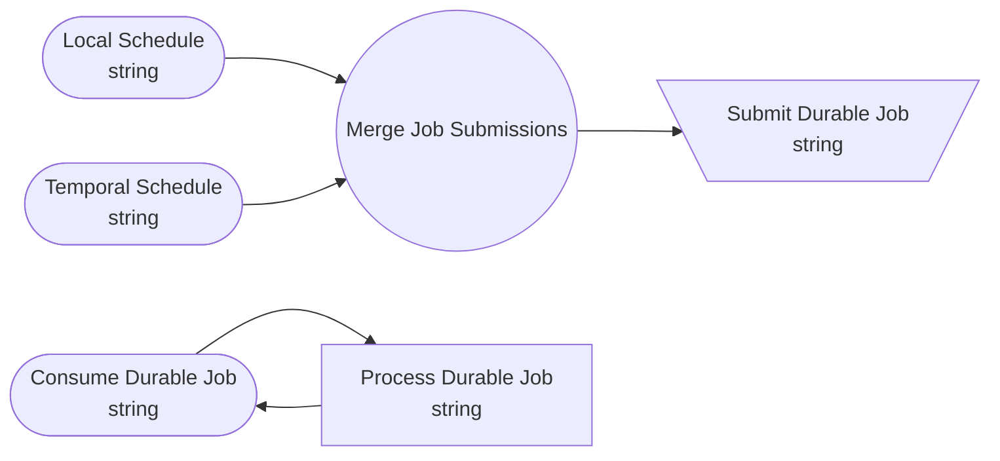

# Pipeline: automation

```mermaid
flowchart LR
  s3(["Consume Durable Job
string"])
  s4(["Local Schedule
string"])
  s7(("Merge Job Submissions"))
  s8["Process Durable Job
string"]
  s9[\"Submit Durable Job
string"/]
  s10(["Temporal Schedule
string"])
  s8 --> s3
  s4 --> s7
  s10 --> s7
  s3 --> s8
  s7 --> s9
```
