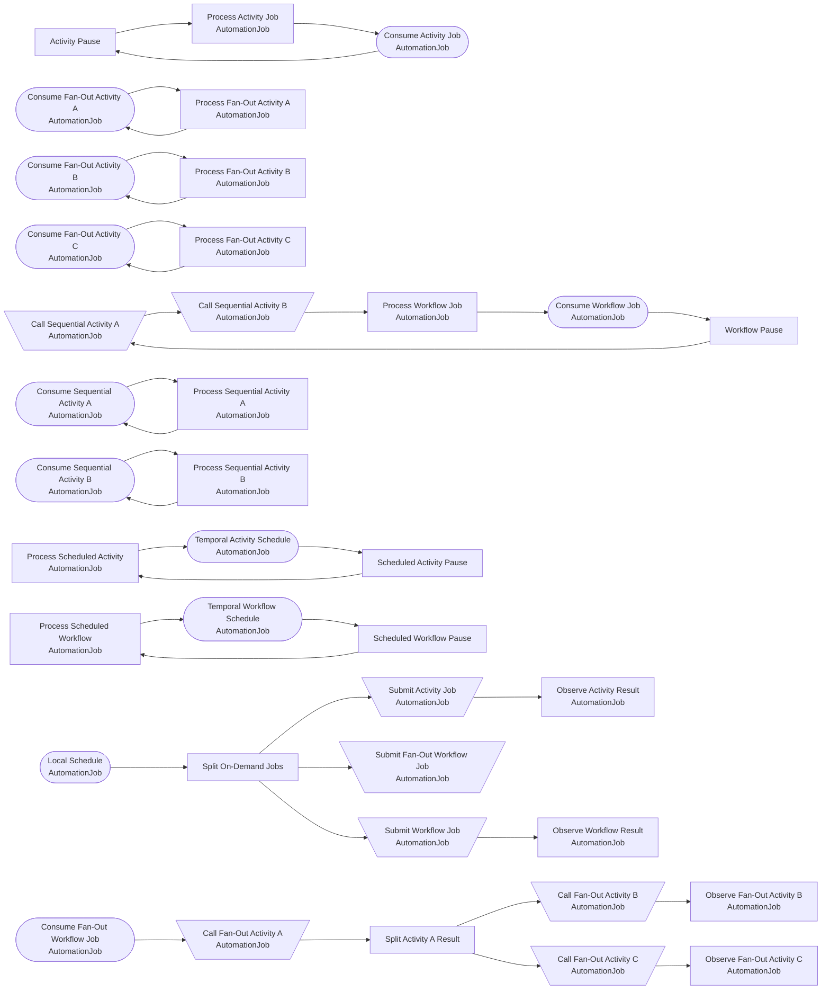

# Pipeline: automation

```mermaid
flowchart LR
  s22["Activity Pause"]
  s23[\"Call Fan-Out Activity A
AutomationJob"/]
  s24[\"Call Fan-Out Activity B
AutomationJob"/]
  s25[\"Call Fan-Out Activity C
AutomationJob"/]
  s26[\"Call Sequential Activity A
AutomationJob"/]
  s27[\"Call Sequential Activity B
AutomationJob"/]
  s28(["Consume Activity Job
AutomationJob"])
  s29(["Consume Fan-Out Activity A
AutomationJob"])
  s30(["Consume Fan-Out Activity B
AutomationJob"])
  s31(["Consume Fan-Out Activity C
AutomationJob"])
  s32(["Consume Fan-Out Workflow Job
AutomationJob"])
  s33(["Consume Sequential Activity A
AutomationJob"])
  s34(["Consume Sequential Activity B
AutomationJob"])
  s35(["Consume Workflow Job
AutomationJob"])
  s36(["Local Schedule
AutomationJob"])
  s37["Observe Activity Result
AutomationJob"]
  s38["Observe Fan-Out Activity B
AutomationJob"]
  s39["Observe Fan-Out Activity C
AutomationJob"]
  s40["Observe Workflow Result
AutomationJob"]
  s41["Process Activity Job
AutomationJob"]
  s42["Process Fan-Out Activity A
AutomationJob"]
  s43["Process Fan-Out Activity B
AutomationJob"]
  s44["Process Fan-Out Activity C
AutomationJob"]
  s45["Process Scheduled Activity
AutomationJob"]
  s46["Process Scheduled Workflow
AutomationJob"]
  s47["Process Sequential Activity A
AutomationJob"]
  s48["Process Sequential Activity B
AutomationJob"]
  s49["Process Workflow Job
AutomationJob"]
  s50["Scheduled Activity Pause"]
  s51["Scheduled Workflow Pause"]
  s52["Split Activity A Result"]
  s53["Split On-Demand Jobs"]
  s54[\"Submit Activity Job
AutomationJob"/]
  s55[\"Submit Fan-Out Workflow Job
AutomationJob"/]
  s56[\"Submit Workflow Job
AutomationJob"/]
  s57(["Temporal Activity Schedule
AutomationJob"])
  s58(["Temporal Workflow Schedule
AutomationJob"])
  s59["Workflow Pause"]
  s28 --> s22
  s32 --> s23
  s52 --> s24
  s52 --> s25
  s59 --> s26
  s26 --> s27
  s41 --> s28
  s42 --> s29
  s43 --> s30
  s44 --> s31
  s47 --> s33
  s48 --> s34
  s49 --> s35
  s54 --> s37
  s24 --> s38
  s25 --> s39
  s56 --> s40
  s22 --> s41
  s29 --> s42
  s30 --> s43
  s31 --> s44
  s50 --> s45
  s51 --> s46
  s33 --> s47
  s34 --> s48
  s27 --> s49
  s57 --> s50
  s58 --> s51
  s23 --> s52
  s36 --> s53
  s53 --> s54
  s53 --> s55
  s53 --> s56
  s45 --> s57
  s46 --> s58
  s35 --> s59
```
