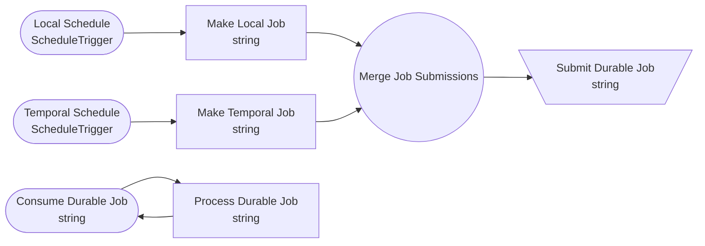

# Pipeline: automation

```mermaid
flowchart LR
  s3(["Consume Durable Job
string"])
  s4(["Local Schedule
ScheduleTrigger"])
  s5["Make Local Job
string"]
  s6["Make Temporal Job
string"]
  s7(("Merge Job Submissions"))
  s8["Process Durable Job
string"]
  s9[\"Submit Durable Job
string"/]
  s10(["Temporal Schedule
ScheduleTrigger"])
  s8 --> s3
  s4 --> s5
  s10 --> s6
  s5 --> s7
  s6 --> s7
  s3 --> s8
  s7 --> s9
```
