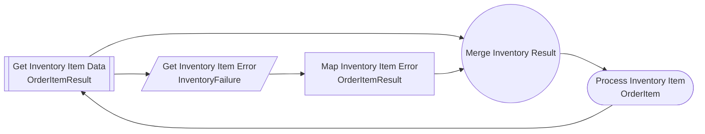

# Pipeline: inventoryItem

```mermaid
flowchart LR
  s73[["Get Inventory Item Data
OrderItemResult"]]
  s74[/"Get Inventory Item Error
InventoryFailure"/]
  s75["Map Inventory Item Error
OrderItemResult"]
  s76(("Merge Inventory Result"))
  s77(["Process Inventory Item
OrderItem"])
  s77 --> s73
  s73 --> s74
  s74 --> s75
  s73 --> s76
  s75 --> s76
  s76 --> s77
```
