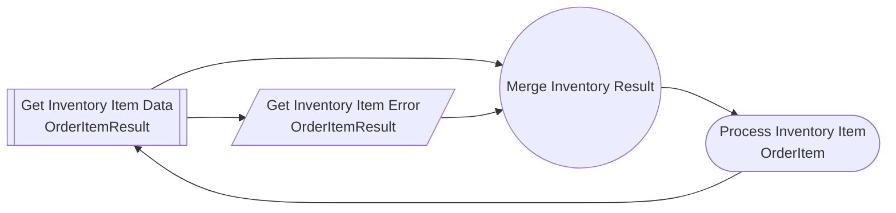

# Pipeline: inventoryItem

```mermaid
flowchart LR
  s73[["Get Inventory Item Data
OrderItemResult"]]
  s74[/"Get Inventory Item Error
OrderItemResult"/]
  s75(("Merge Inventory Result"))
  s76(["Process Inventory Item
OrderItem"])
  s76 --> s73
  s73 --> s74
  s73 --> s75
  s74 --> s75
  s75 --> s76
```
