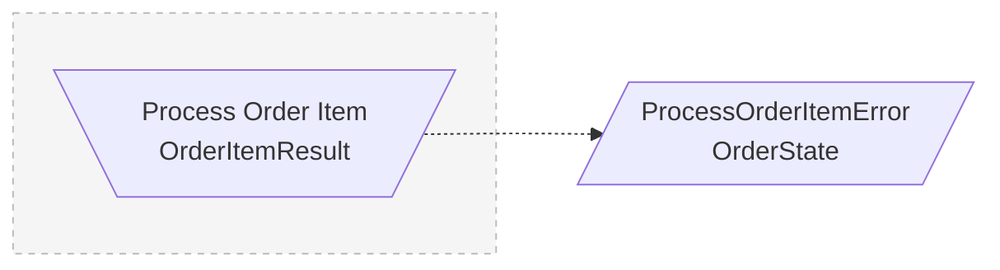

# Pipeline: default

```mermaid
flowchart LR
  subgraph ext[" "]
    style ext fill:#f5f5f5,stroke:#bbb,stroke-dasharray:4
    s83[\"Process Order Item
OrderItemResult"/]
  end
  s77[/"ProcessOrderItemError
OrderState"/]
  s83 -.-> s77
```
