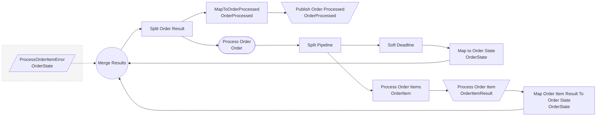

# Pipeline: order

```mermaid
flowchart LR
  subgraph ext[" "]
    style ext fill:#f5f5f5,stroke:#bbb,stroke-dasharray:4
    s64[/"ProcessOrderItemError
OrderState"/]
  end
  s65["Map Order Item Result To Order State
OrderState"]
  s66["MapToOrderProcessed
OrderProcessed"]
  s67["Map to Order State
OrderState"]
  s68(("Merge Results"))
  s69(["Process Order
Order"])
  s70[\"Process Order Item
OrderItemResult"/]
  s71["Process Order Items
OrderItem"]
  s72[\"Publish Order Processed
OrderProcessed"/]
  s73["Soft Deadline"]
  s74["Split Order Result"]
  s75["Split Pipeline"]
  s70 --> s65
  s74 --> s66
  s73 --> s67
  s67 --> s68
  s65 --> s68
  s64 -.-> s68
  s74 --> s69
  s71 --> s70
  s75 --> s71
  s66 --> s72
  s75 --> s73
  s68 --> s74
  s69 --> s75
```
